<sup>Generated from [docs/documentation.ipynb](docs/documentation.ipynb) by [../scripts/update_nn_README.py](../scripts/update_nn_README.py).
</sup>
# Table of contents

* [Dataset](#dataset)
	* [Training Area](#training-area)
	* [Flights](#flights)
	* [Weather Data](#weather-data)
		* [List of Weather Parameters Used](#list-of-weather-parameters-used)
* [Neural Network](#neural-network)
	* [Introduction](#introduction)
	* [Network Architecture](#network-architecture)
		* [Diagram](#diagram)
			* [Cells](#cells)
			* [Spots](#spots)
			* [Indicators](#indicators)
	* [Population Block](#population-block)
		* [Date and Day of Week Modifiers](#date-and-day-of-week-modifiers)
		* [Cells](#cells-2)
		* [Spots](#spots-2)
	* [Wind Block](#wind-block)
		* [Input](#input)
		* [Model](#model)
			* [Cells](#cells-3)
			* [Spots](#spots-3)
* [Training](#training)

<details><summary>Expand code</summary><p>

```python
import numpy as np, matplotlib.pyplot as plt, sys, os, calendar, glob, math, pickle, collections, logging, matplotlib.cm
from dateutil import parser
from mpl_toolkits.mplot3d import Axes3D
from mpl_toolkits.basemap import Basemap

sys.path.append("../")
from inc.dataset import FlightsData

weights_dir = "../bin/models/CLASSIFICATION_1.0.0/weights/"
if not os.path.exists("../bin/data/flights_by_cell_day.pkl"): # Check data is downloaded
    raise FileNotFoundError("You must first download data by running 'cd "+ os.path.abspath("../../scripts/") +"; python download_data.py'")

with open("../bin/data/sorted_cells_latlon.pkl", "rb") as fin:
    sorted_cells_latlon = pickle.load(fin, encoding='latin1')
with open("../bin/data/flights_by_cell_day.pkl", "rb") as fin:
    flights_by_cell_day = pickle.load(fin, encoding='latin1')
with open("../bin/data/meteo_days.pkl", "rb") as fin:
    meteo_days = pickle.load(fin, encoding='latin1')
with open("../bin/data/meteo_params.pkl", "rb") as fin:
    weather_params = pickle.load(fin, encoding='latin1')
with open("../bin/data/meteo_days.pkl", "rb") as fin:
    meteo_days = pickle.load(fin, encoding='latin1')
```

</p></details>

# Dataset

The current training area is focused on the Alps as there is no time zone management for now.
This area is segmented in 1°x1°x100hPa cells, corresponding to the [GFS Analysis](https://www.ncdc.noaa.gov/data-access/model-data/model-datasets/global-forcast-system-gfs) cells.

## Training Area


<details><summary>Expand code</summary><p>

```python
cell_reso = 1.0
min_lat, max_lat = min([c[0] for c in sorted_cells_latlon])-cell_reso/2., max([c[0] for c in sorted_cells_latlon])+cell_reso/2.
min_lon, max_lon = min([c[1] for c in sorted_cells_latlon])-cell_reso/2., max([c[1] for c in sorted_cells_latlon])+cell_reso/2.

plt.figure(figsize=((max_lon-min_lon)*.85, (max_lat-min_lat)*.85))
plt.title("Training cells and flights")
m = Basemap(projection='mill', llcrnrlon=min_lon-2.5, llcrnrlat=min_lat-2.5, urcrnrlon=max_lon+2.5, urcrnrlat=max_lat+2.5, resolution='h')
m.shadedrelief()

# Draw training weather grid (GFS 1°x1°)
for lat in range(1, round((max_lat-min_lat)/cell_reso)):
    m.plot([min_lon, max_lon], [min_lat + lat*cell_reso, min_lat + lat*cell_reso], '-', linewidth=1, color='r', alpha=0.325, latlon=True)
for lon in range(1, round((max_lon-min_lon)/cell_reso)):
    m.plot([min_lon + lon*cell_reso, min_lon + lon*cell_reso], [min_lat, max_lat], '-', linewidth=1, color='r', alpha=0.325, latlon=True)
m.plot([min_lon, max_lon, max_lon, min_lon, min_lon], [min_lat, min_lat, max_lat, max_lat, min_lat], '-', linewidth=2, color=(1., 0., 0.), latlon=True)

# Draw flights
m.scatter(np.array([f[1][4] for fd in flights_by_cell_day for f in fd]), # longitudes of training flights
          np.array([f[1][3] for fd in flights_by_cell_day for f in fd]), # latitudes of training flights
          marker='o', color='b', s=0.1, alpha=0.1, latlon=True)

plt.show()
```

</p></details>


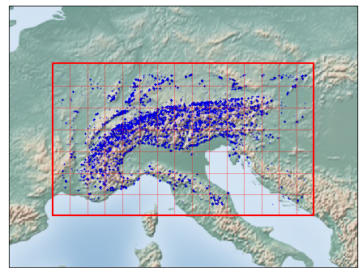


## Flights

We consider only the take-off coordinates (latitude, longitude, altitude) of a flight because, far from any take-off area, an absence of flight does not implies non-flyability.

Flights statistics:


<details><summary>Expand code</summary><p>

```python
# Count days per year
counter_days, counter_months = collections.Counter(), collections.Counter()
for day in meteo_days:
    counter_days[str(day.year)] += 1
    counter_months["%02d"%day.month] += 1

# Count flights per year
counter_flights_by_year, counter_flights_by_month, counter_flights_by_alt, counter_flights_by_dow = collections.Counter(), collections.Counter(), collections.Counter(), collections.Counter()
for cell_day in flights_by_cell_day:
    for flight in cell_day:
        counter_flights_by_alt[FlightsData.kAltitude(flight[1][5])] += 1
    try:
        counter_flights_by_year [cell_day[0][0][0:4]] += len(cell_day) # counter[year]  += nb_flights
        counter_flights_by_month[cell_day[0][0][5:7]] += len(cell_day) # counter[month] += nb_flights
        counter_flights_by_dow  [parser.parse(cell_day[0][0]).strftime("%a")] += len(cell_day) # counter[dow]   += nb_flights
    except IndexError:
        pass
    
fig, axes = plt.subplots(nrows=3, ncols=2, figsize=(14, 10))
years, months, dow = sorted(list(counter_days)), sorted(list(counter_months)), ['Mon', 'Tue', 'Wed', 'Thu', 'Fri', 'Sat', 'Sun']
axes[0,0].set_title("nb days with available weather data")
axes[0,0].bar(years, [counter_days[y] for y in years], color='#f07000')
axes[0,1].set_title("nb flights in available days, by year")
axes[0,1].bar(years, [counter_flights_by_year[y] for y in years])
axes[1,0].set_title("nb flights per days, by year")
axes[1,0].bar(years, [counter_flights_by_year[y]/counter_days[y] for y in years])
axes[1,1].set_title("nb flights per days, by month")
axes[1,1].bar(months, [counter_flights_by_month[m]/counter_months[m] for m in months])
axes[2,0].set_title("nb flights by day of week")
axes[2,0].bar(dow, [counter_flights_by_dow[d] for d in dow])
print("Nb flights by day of week:", [counter_flights_by_dow[d] for d in dow])

# Flights by altitude
axes[2,1].set_title("nb flights by altitude level")
nb_alts = max(counter_flights_by_alt.keys())+1
axes[2,1].barh(["%d"%alt for alt in range(nb_alts)], [counter_flights_by_alt[alt] for alt in range(nb_alts)])
for alt in range(nb_alts):
    axes[2,1].text(counter_flights_by_alt[alt], alt-0.06, str(counter_flights_by_alt[alt]), fontsize=12)   
axes[2,1].set_xlim(0, 1.125*max(counter_flights_by_alt.values()))

fig.tight_layout()
```

</p></details>

    Nb flights by day of week: [111383, 107993, 117721, 131987, 154665, 266616, 238255]


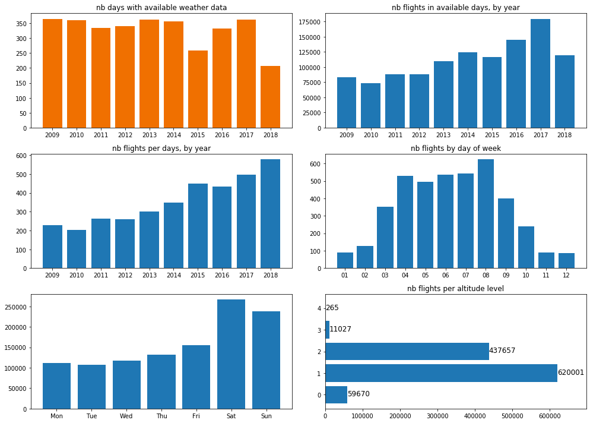


<details><summary>Expand code</summary><p>

```python
max_score = 75
pts = [[] for m in range(0, 12)]

for cell_day in flights_by_cell_day:
    try:
        pts[int(cell_day[0][0][5:7])-1] += [f[1][0] for f in cell_day]
    except IndexError:
        pass

plt.figure(figsize=(12, 5))
plt.title("Number of flights by XC score for each month")
for m in range(12):
    plt.plot(np.histogram(pts[m], bins=max_score, range=(0, max_score))[0], label=calendar.month_name[m+1])
plt.xlim(0., max_score-1)
plt.ylim(ymin=0.)
plt.legend(bbox_to_anchor=(1.05, 1), loc='upper left', borderaxespad=0)
plt.show()
```

</p></details>


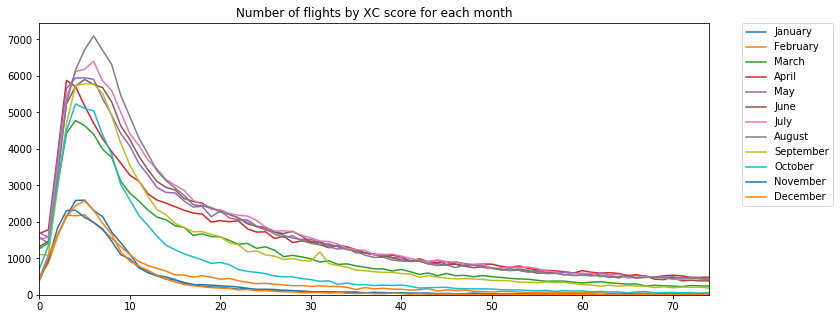


## Weather Data

Experiments have been done with [ECMWF](https://www.ecmwf.int/) and [Météo France](http://www.meteofrance.com/previsions-meteo-france/simulations-numeriques-meteorologiques/france), but the [GFS model from NOAA](https://www.ncdc.noaa.gov/data-access/model-data/model-datasets/global-forcast-system-gfs) is the only  model I know with both past and forecast data for free.
Using the same model for training and forecasting is important and allows to learn and overcome the model weaknesses.
This is why, I am using this only source of weather information currently.

The weather paramaters present in the GFS Analysis data have varied over time. We must select a subset present during the whole training interval. The same list of parameters, at 3 different hours (06:00, 12:00, 18:00) are used.

### List of Weather Parameters Used


<details><summary>Expand code</summary><p>

```python
nbh = 3
nbp = len(weather_params)//nbh # Number of parameters per hour
for krow in range(nbp):
    print("{: <39} {: <39} {: <39}".format(*[("%02d:00 %s at %s hPa" % (weather_params[krow+h*nbp][0],
                                                                        weather_params[krow+h*nbp][1],
                                                                    str(weather_params[krow+h*nbp][2][0][1]))).replace(" at 0 hPa", "") for h in range(nbh)]))
```

</p></details>

    06:00 Precipitable water                12:00 Precipitable water                18:00 Precipitable water               
    06:00 Cloud water                       12:00 Cloud water                       18:00 Cloud water                      
    06:00 Vertical velocity at 1000 hPa     12:00 Vertical velocity at 1000 hPa     18:00 Vertical velocity at 1000 hPa    
    06:00 Vertical velocity at 900 hPa      12:00 Vertical velocity at 900 hPa      18:00 Vertical velocity at 900 hPa     
    06:00 Vertical velocity at 800 hPa      12:00 Vertical velocity at 800 hPa      18:00 Vertical velocity at 800 hPa     
    06:00 Vertical velocity at 700 hPa      12:00 Vertical velocity at 700 hPa      18:00 Vertical velocity at 700 hPa     
    06:00 Vertical velocity at 600 hPa      12:00 Vertical velocity at 600 hPa      18:00 Vertical velocity at 600 hPa     
    06:00 Vertical velocity at 500 hPa      12:00 Vertical velocity at 500 hPa      18:00 Vertical velocity at 500 hPa     
    06:00 Vertical velocity at 400 hPa      12:00 Vertical velocity at 400 hPa      18:00 Vertical velocity at 400 hPa     
    06:00 Vertical velocity at 300 hPa      12:00 Vertical velocity at 300 hPa      18:00 Vertical velocity at 300 hPa     
    06:00 Vertical velocity at 200 hPa      12:00 Vertical velocity at 200 hPa      18:00 Vertical velocity at 200 hPa     
    06:00 Geopotential Height at 1000 hPa   12:00 Geopotential Height at 1000 hPa   18:00 Geopotential Height at 1000 hPa  
    06:00 Geopotential Height at 900 hPa    12:00 Geopotential Height at 900 hPa    18:00 Geopotential Height at 900 hPa   
    06:00 Geopotential Height at 800 hPa    12:00 Geopotential Height at 800 hPa    18:00 Geopotential Height at 800 hPa   
    06:00 Geopotential Height at 700 hPa    12:00 Geopotential Height at 700 hPa    18:00 Geopotential Height at 700 hPa   
    06:00 Geopotential Height at 600 hPa    12:00 Geopotential Height at 600 hPa    18:00 Geopotential Height at 600 hPa   
    06:00 Geopotential Height at 500 hPa    12:00 Geopotential Height at 500 hPa    18:00 Geopotential Height at 500 hPa   
    06:00 Geopotential Height at 400 hPa    12:00 Geopotential Height at 400 hPa    18:00 Geopotential Height at 400 hPa   
    06:00 Geopotential Height at 300 hPa    12:00 Geopotential Height at 300 hPa    18:00 Geopotential Height at 300 hPa   
    06:00 Geopotential Height at 200 hPa    12:00 Geopotential Height at 200 hPa    18:00 Geopotential Height at 200 hPa   
    06:00 Absolute vorticity at 1000 hPa    12:00 Absolute vorticity at 1000 hPa    18:00 Absolute vorticity at 1000 hPa   
    06:00 Absolute vorticity at 900 hPa     12:00 Absolute vorticity at 900 hPa     18:00 Absolute vorticity at 900 hPa    
    06:00 Absolute vorticity at 800 hPa     12:00 Absolute vorticity at 800 hPa     18:00 Absolute vorticity at 800 hPa    
    06:00 Absolute vorticity at 700 hPa     12:00 Absolute vorticity at 700 hPa     18:00 Absolute vorticity at 700 hPa    
    06:00 Absolute vorticity at 600 hPa     12:00 Absolute vorticity at 600 hPa     18:00 Absolute vorticity at 600 hPa    
    06:00 Absolute vorticity at 500 hPa     12:00 Absolute vorticity at 500 hPa     18:00 Absolute vorticity at 500 hPa    
    06:00 Absolute vorticity at 400 hPa     12:00 Absolute vorticity at 400 hPa     18:00 Absolute vorticity at 400 hPa    
    06:00 Absolute vorticity at 300 hPa     12:00 Absolute vorticity at 300 hPa     18:00 Absolute vorticity at 300 hPa    
    06:00 Absolute vorticity at 200 hPa     12:00 Absolute vorticity at 200 hPa     18:00 Absolute vorticity at 200 hPa    
    06:00 Temperature at 1000 hPa           12:00 Temperature at 1000 hPa           18:00 Temperature at 1000 hPa          
    06:00 Temperature at 900 hPa            12:00 Temperature at 900 hPa            18:00 Temperature at 900 hPa           
    06:00 Temperature at 800 hPa            12:00 Temperature at 800 hPa            18:00 Temperature at 800 hPa           
    06:00 Temperature at 700 hPa            12:00 Temperature at 700 hPa            18:00 Temperature at 700 hPa           
    06:00 Temperature at 600 hPa            12:00 Temperature at 600 hPa            18:00 Temperature at 600 hPa           
    06:00 Temperature at 500 hPa            12:00 Temperature at 500 hPa            18:00 Temperature at 500 hPa           
    06:00 Temperature at 400 hPa            12:00 Temperature at 400 hPa            18:00 Temperature at 400 hPa           
    06:00 Temperature at 300 hPa            12:00 Temperature at 300 hPa            18:00 Temperature at 300 hPa           
    06:00 Temperature at 200 hPa            12:00 Temperature at 200 hPa            18:00 Temperature at 200 hPa           
    06:00 Relative humidity at 1000 hPa     12:00 Relative humidity at 1000 hPa     18:00 Relative humidity at 1000 hPa    
    06:00 Relative humidity at 900 hPa      12:00 Relative humidity at 900 hPa      18:00 Relative humidity at 900 hPa     
    06:00 Relative humidity at 800 hPa      12:00 Relative humidity at 800 hPa      18:00 Relative humidity at 800 hPa     
    06:00 Relative humidity at 700 hPa      12:00 Relative humidity at 700 hPa      18:00 Relative humidity at 700 hPa     
    06:00 Relative humidity at 600 hPa      12:00 Relative humidity at 600 hPa      18:00 Relative humidity at 600 hPa     
    06:00 Relative humidity at 500 hPa      12:00 Relative humidity at 500 hPa      18:00 Relative humidity at 500 hPa     
    06:00 Relative humidity at 400 hPa      12:00 Relative humidity at 400 hPa      18:00 Relative humidity at 400 hPa     
    06:00 Relative humidity at 300 hPa      12:00 Relative humidity at 300 hPa      18:00 Relative humidity at 300 hPa     
    06:00 Relative humidity at 200 hPa      12:00 Relative humidity at 200 hPa      18:00 Relative humidity at 200 hPa     
    06:00 U component of wind at 1000 hPa   12:00 U component of wind at 1000 hPa   18:00 U component of wind at 1000 hPa  
    06:00 U component of wind at 900 hPa    12:00 U component of wind at 900 hPa    18:00 U component of wind at 900 hPa   
    06:00 U component of wind at 800 hPa    12:00 U component of wind at 800 hPa    18:00 U component of wind at 800 hPa   
    06:00 U component of wind at 700 hPa    12:00 U component of wind at 700 hPa    18:00 U component of wind at 700 hPa   
    06:00 U component of wind at 600 hPa    12:00 U component of wind at 600 hPa    18:00 U component of wind at 600 hPa   
    06:00 U component of wind at 500 hPa    12:00 U component of wind at 500 hPa    18:00 U component of wind at 500 hPa   
    06:00 U component of wind at 400 hPa    12:00 U component of wind at 400 hPa    18:00 U component of wind at 400 hPa   
    06:00 U component of wind at 300 hPa    12:00 U component of wind at 300 hPa    18:00 U component of wind at 300 hPa   
    06:00 U component of wind at 200 hPa    12:00 U component of wind at 200 hPa    18:00 U component of wind at 200 hPa   
    06:00 V component of wind at 1000 hPa   12:00 V component of wind at 1000 hPa   18:00 V component of wind at 1000 hPa  
    06:00 V component of wind at 900 hPa    12:00 V component of wind at 900 hPa    18:00 V component of wind at 900 hPa   
    06:00 V component of wind at 800 hPa    12:00 V component of wind at 800 hPa    18:00 V component of wind at 800 hPa   
    06:00 V component of wind at 700 hPa    12:00 V component of wind at 700 hPa    18:00 V component of wind at 700 hPa   
    06:00 V component of wind at 600 hPa    12:00 V component of wind at 600 hPa    18:00 V component of wind at 600 hPa   
    06:00 V component of wind at 500 hPa    12:00 V component of wind at 500 hPa    18:00 V component of wind at 500 hPa   
    06:00 V component of wind at 400 hPa    12:00 V component of wind at 400 hPa    18:00 V component of wind at 400 hPa   
    06:00 V component of wind at 300 hPa    12:00 V component of wind at 300 hPa    18:00 V component of wind at 300 hPa   
    06:00 V component of wind at 200 hPa    12:00 V component of wind at 200 hPa    18:00 V component of wind at 200 hPa   


# Neural Network

## Introduction

The problem of flyability prediction is formulated as a classification problem where the input X is the weather data  in a 3D cell and the output Y is the absence/presence of at least one reported flight in this cell.
We assume that the presence of reported flights implies _flyability_ but, absence of reported flights does not imply _non-flyability_.
The gap between reported flights and _flyability_ is explained by what we call the [population](#Population-Block).

<p align="center">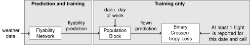</p>

## Network Architecture

Defined in [model.py](docs/../inc/model.py)

There are two different models:
* The **_cells_** model: takes the weather data for a cell, and gives prediction for the whole cell. This prediction determines the map color.
* The **_spots_** model: takes the weather data for a cell and gives different predictions for each take-off spot of the cell, taking into account their learned specificities regarding the wind.

The networks are a combination of handcrafted models with internal variables (Wind Block, Population Block) and neural networks (Flyability Block, Crossability Block), all optimized together.

### Diagram

The tensors going through the network are drawn as follows. The first and last tensor dimensions are not drawn. The first one is `nb_samples` (number of training days) and the last one is the `feature_dimension`, which is given between parenthesis beside the variable name.
The optimized variables are drawn the same way, but, of course, they do not have a first `nb_samples` dimension.

<p align="center">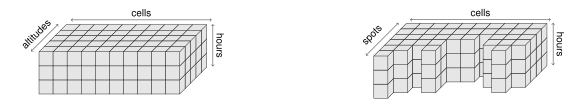</p>

For example, the "wind (8)" tensor is of shape `(nb_samples, nb_cells, nb_altitudes=5, nb_hours=3, feature_dimension=8)`.

| <h4>Cells</h4> | <h4>Spots</h4> |
| :-: | :-: |
| 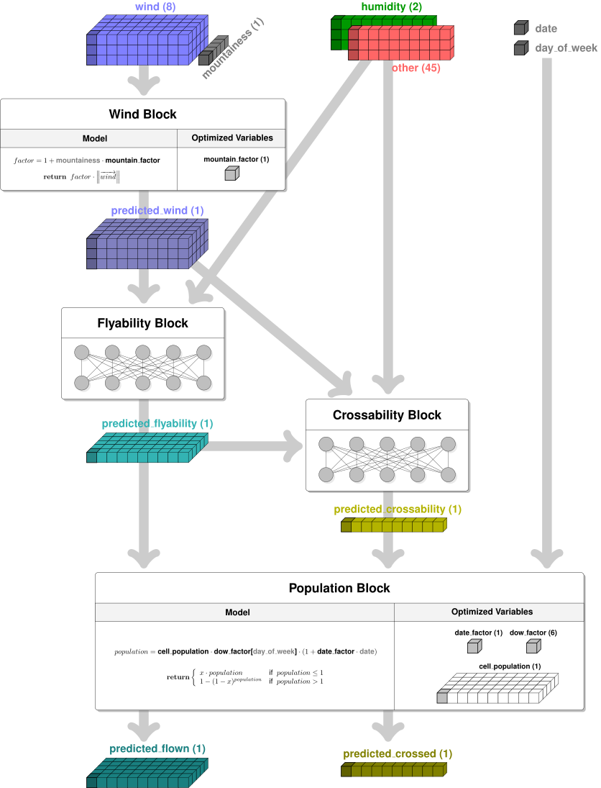 | 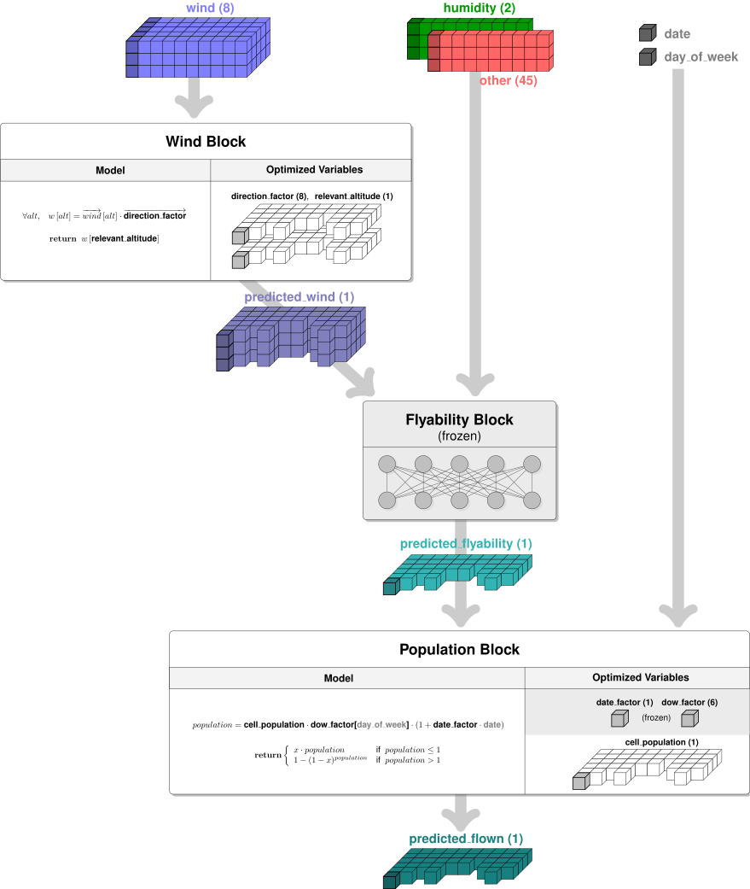 |


<h4>Indicators</h4>

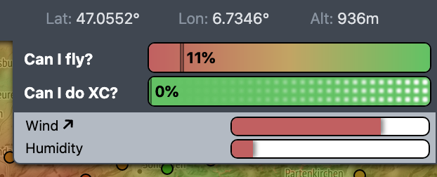

In the **_cells_** model, some interpretation cues on the conditions are jointly computed.
Currently, two of them are implemented: the <em>wind-flyability</em> and the <em>humidity-flyability</em> indicators.
They are visible on the [site](https://paraglidable.com), dropping down below the main predictions.

They are computed by predicting flyability from wind-related and humidity-related inputs only.

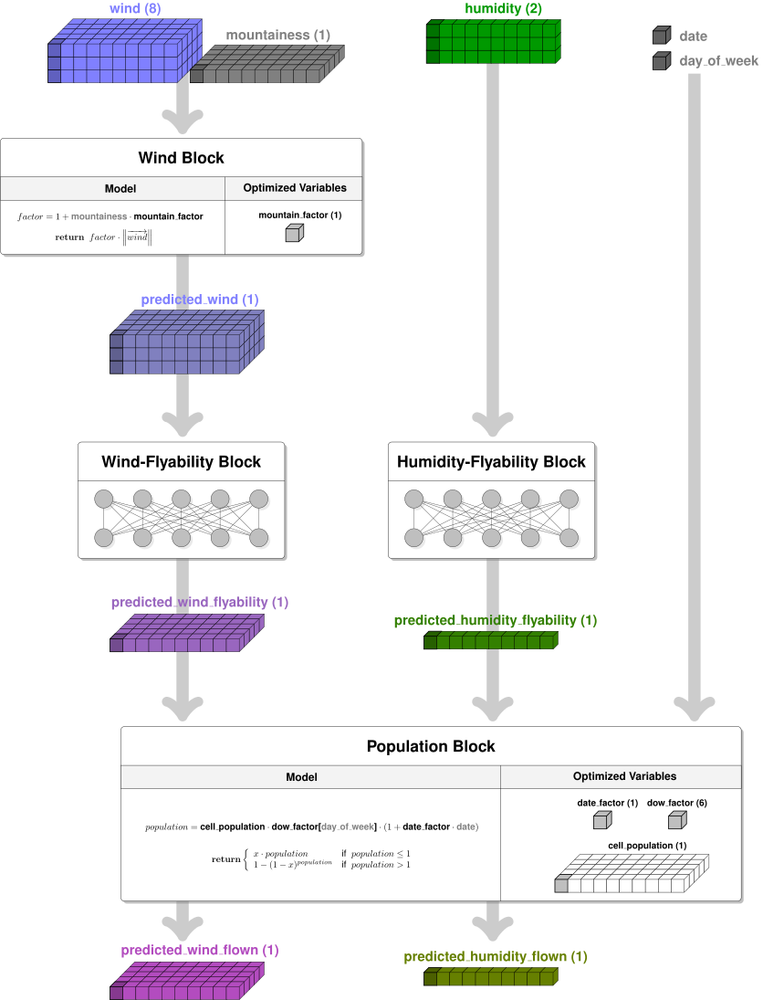

## Population Block

The decision for a paraglider to go fly is modeled by a random variable of Bernoulli distribution of parameter named the _flyability_.
The paragliders decisions are supposed independent.


The Population Block computes the probability that at least one person goes fly given the _flyability_ and the _population_.
The _population_ for each cell and spot is an inner variable, optimized during training.


<details><summary>Expand code</summary><p>

```python
r = 200
in_proba   = np.array([[1.*(float(x)/float(r-1))**2. for y in range(r)] for x in range(r)], np.float)
population = np.array([[4.*(float(y)/float(r-1))**2. for y in range(r)] for x in range(r)], np.float)
out_proba  = np.array([[in_proba[x,y]*population[x,y] if population[x,y]<=1. else 1. - (1. - in_proba[x,y])**population[x,y] for y in range(r)] for x in range(r)], np.float)

logging.getLogger().disabled = True
ax = plt.figure(figsize=(9,5)).add_subplot(111, projection='3d')
ax.view_init(35, 210)
ax.set_xlim3d(0., np.amax(in_proba))
ax.set_ylim3d(0., np.amax(population))
ax.set_xlabel('Input probability')
ax.set_ylabel('Population value')
ax.set_zlabel('Output probability')

ax.plot_surface(in_proba, population, out_proba, cmap=matplotlib.cm.jet)

for p in [0.5*p for p in range(0,2)]:
    ax.plot([1.*(float(x)/float(r-1))**2. for x in range(r)], [p for x in range(r)], [p*(float(x)/float(r-1))**2. for x in range(r)], alpha=1, color='black', linewidth=1.5, zorder=10)
for p in [0.5*p for p in range(2,9)]:
    ax.plot([1.*(float(x)/float(r-1))**2. for x in range(r)], [p for x in range(r)], [1. - (1. - 1.*(float(x)/float(r-1))**2.)**p for x in range(r)], alpha=1, color='black', linewidth=1.5, zorder=10)

logging.getLogger().disabled = False
```

</p></details>


### Date and Day of Week Modifiers

The Population Block takes into account the date (0 to 1 from the start to the end of the training interval) and the one-hot encoded day of week from Monday to Sunday.


<details><summary>Expand code</summary><p>

```python
date_factor = np.load(weights_dir+"population_date.npy")[0]

print("date_factor =", date_factor[0], "i.e. +%.1f%% in %.1f years, supposed linear."%(date_factor[0]*100., (meteo_days[-1]-meteo_days[0]).days/365.))

if False:
    dow_factor  = np.load(weights_dir+"population_dow.npy")[0]
    plt.figure(figsize=(8, 3.5))
    plt.bar(calendar.day_name, dow_factor)
    plt.title('dow_factor')
    plt.show()
```

</p></details>

    date_factor = 1.3891177 i.e. +138.9% in 9.6 years, supposed linear.


### Cells


<details><summary>Expand code</summary><p>

```python
cell_population = [np.sum(np.load(f)) for f in sorted(glob.glob(weights_dir+"population_alt_cell_*.npy"))]

plt.bar(range(len(cell_population)), sorted(cell_population)[::-1])
plt.title("Cells population summed over all the altitudes sorted by population")
plt.show()
```

</p></details>


### Spots


<details><summary>Expand code</summary><p>

```python
spot_population = np.concatenate([np.load(f)[0] for f in sorted(glob.glob(weights_dir+"population_0_spots__cell_*.npy"))])

plt.plot(np.sort(spot_population)[::-1])
plt.title("Spots population sorted by population")
plt.show()
```

</p></details>


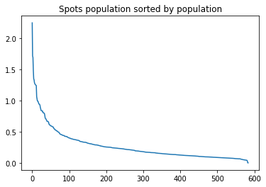


## Wind Block

### Input

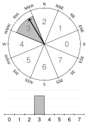

The wind_vector from GFS is quantized in 8 directions (0°, 45°, 90°, 135°, 180°, -135°, -90°, -45°)


### Model
#### Cells

For the cells forecasts, only the norm is considered:


The <em>mountainess_factor</em> aims to take into account that the tolerable wind in the plain is greater than in mountain areas.


<details><summary>Expand code</summary><p>

```python
mountainess_factor = np.load(weights_dir+"wind_block_cells_0.npy")[0]
print("mountainess_factor =", mountainess_factor)
```

</p></details>

    mountainess_factor = 0.5023645


#### Spots
The returned value is the dot product between the wind and the <em>direction_factor</em> at all altitudes, interpolated at <em>relevant_altitude</em>.


<details><summary>Expand code</summary><p>

```python
direction_factor  = [np.load(f)[0] for f in glob.glob(weights_dir+"wind_block_spots_0__cell_*.npy")]
relevant_altitude = [np.load(f)[0,0] for f in glob.glob(weights_dir+"wind_block_spots_1__cell_*.npy")]

fig, axes = plt.subplots(nrows=1, ncols=2, figsize=(14, 4.5))
for spot in direction_factor:
    axes[0].plot(spot)
axes[0].set_title("direction_factor")
axes[1].hist(relevant_altitude, bins=[v/4.0 for v in range(0,14)])
axes[1].set_title("relevant_altitude")
fig.tight_layout()
```

</p></details>


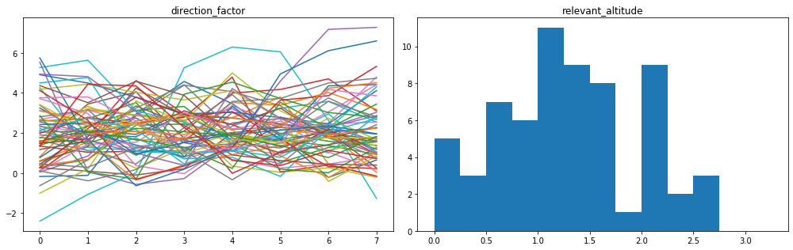


# Training

The [training procedure](docs/../train.py) uses:

* Multiple initializations to keep the best after dozens of epochs
* Early stopping
* Fine tuning with bigger training set/smaller validation set

Prediction result on training data can be visualized here: [https://paraglidable.com/?mode=analysis](https://paraglidable.com/?mode=analysis)
